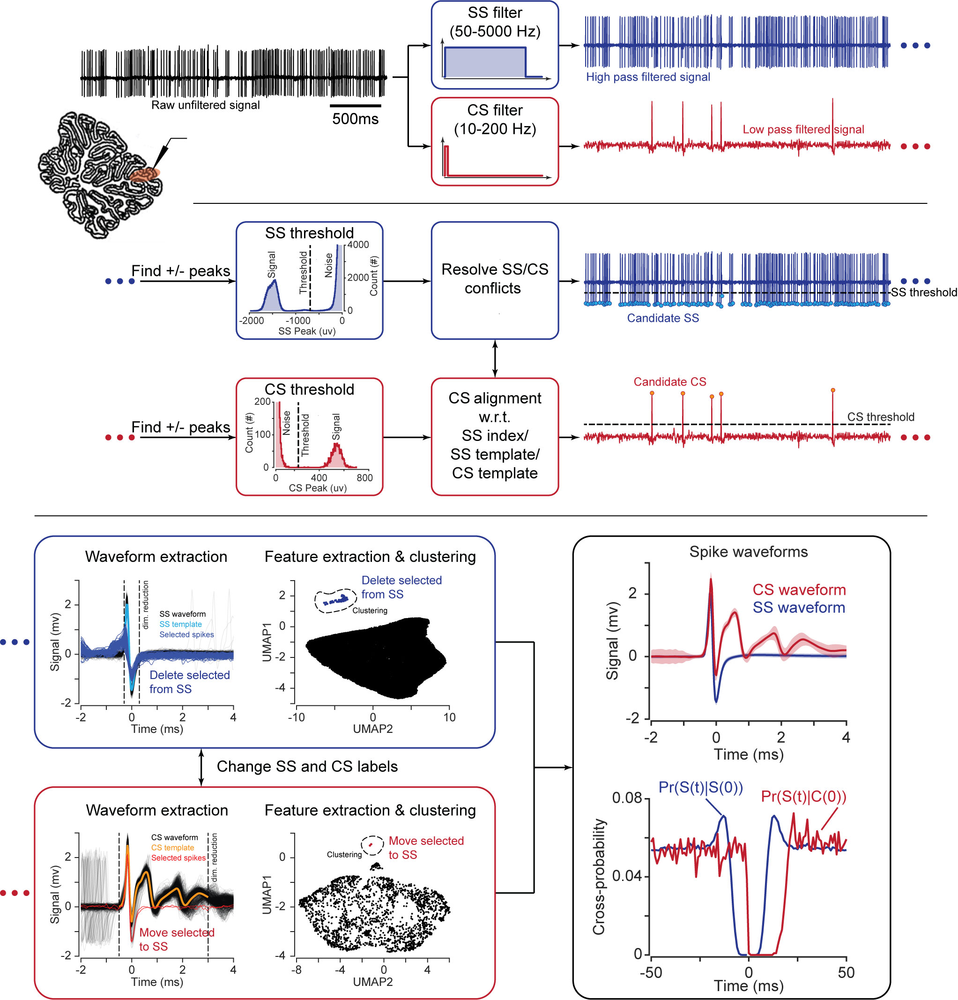

# P-sort: an open-source software for cerebellar neurophysiology
P-sort has been developed in [Shadmehr Lab](http://www.shadmehrlab.org), [Department of Biomedical Engineering](https://www.bme.jhu.edu), [Johns Hopkins University](https://www.jhu.edu) and in collaboration with colleagues from University of Washington and Baylor College of Medicine.

Please refer to our paper for further information.

Sedaghat-Nejad, E., Fakharian, M. A., Pi, J., Hage, P., Kojima, Y., Soetedjo, R., Ohmae, S., Medina, J. F., & Shadmehr, R. (2021). P-sort: an open-source software for cerebellar neurophysiology. *Journal of Neurophysiology*, 126(4), 1055–1075. https://doi.org/10.1152/jn.00172.2021

Please visit our YouTube channel for P-sort tutorials.
[Shadmehr Lab YouTube Channel](https://youtube.com/playlist?list=PLbROvBk7LN5Rb9YN5WtR9swfoLs9_IETU)


# Table of content
- [Introduction](#introduction)
- [P-sort Main Window](#p-sort-main-window)
- [Cluster Module](#cluster-module)
- [Dissect Module](#dissect-module)
- [Installing Anaconda and Necessary Packages](#install-anaconda-and-necessary-packages)
- [Running P-sort](#running-p-sort)
- [Supported File Formats](#supported-file-formats)
- [Working with Psort File](#working-with-psort-file)
- [A Typical Work Flow of P-sort](#a-typical-work-flow-of-p-sort)
- [P-sort Data Model](#p-sort-data-model)

# Introduction
Analysis of electrophysiological data from Purkinje cells (P-cells) of the cerebellum presents challenges for spike detection. Complex spikes have waveforms that vary significantly from one event to the next, raising the problem of misidentification. Even when complex spikes are detected correctly, the simple spikes may belong to a different P-cell, raising the danger of misattribution. We analyzed data from over 300 P-cells in marmosets, macaques, and mice, using our semi-automated software called P-sort that addresses the spike identification and attribution problems. Like other sorting softwares, P-sort relies on nonlinear dimensionality reduction to cluster spikes. However, it also uses the statistical relationship between simple and complex spikes to merge seemingly disparate clusters, or split a single cluster. In comparison with expert manual curation, occasionally P-sort identified significantly more complex spikes, as well as prevented misattribution of clusters. Three existing automatic sorters performed less well, particularly for identification of complex spikes. To improve development of analysis tools for the cerebellum, we provide labeled data for 313 recording sessions, as well as statistical characteristics of waveforms and firing patterns, available for download at https://doi.org/10.17605/osf.io/gjdm4.

P-sort is an open-source, Python-based software that runs on Windows, MacOS, and Linux platforms. To cluster waveforms and identify simple and complex spikes, P-sort uses both a linear dimensionality reduction algorithm and a novel nonlinear algorithm called UMAP (Uniform Manifold Approximation and Projection) (McInnes et al., 2018). Importantly, it quantifies the probabilistic interaction between complex and simple spikes, providing an objective measure that can split a single cluster, or merge two different clusters, despite similarities or differences in their waveforms. Thus, P-sort helps the user go beyond waveforms to improve clustering of spikes.

# P-sort Main Window
To allow P-sort to run on Windows, MacOS, and Linux, the code was written using Python-based libraries (Behnel et al., 2011; Harris et al., 2020; Pedregosa et al., 2011; Virtanen et al., 2020). The GUI was written using PyQt5 (The Qt Company and Riverbank Computing Ltd.) and PyQtGraph to provide a fast and intuitive interaction for the user. To facilitate further development of P-sort by the user community, we used object-oriented coding.

A process starts by loading the data and dividing it into one or more periods of time (called slots). The slot framework helps the user to account for potential drift and fluctuation in spike quality and shape over time. After sorting one slot, the parameters and waveform templates will be copied to the next slot to facilitate the sorting, but the user can further change the parameters independently in each slot.

The sorting process starts by filtering the signal into two channels, Action Potential (AP) and Local Field Potential (LFP). The default is a 4th order Butterworth filter with the 50-5000 and 10-200 Hz range for AP and LFP channels, respectively. However, these parameters can be modified using the GUI to better fit the specific conditions of the data. The default assumption is that simple spikes generate negative peaks in AP channel and complex spikes generate positive peaks in the LFP channel. However, this assumption can be changed via the GUI. Once the respective peaks are detected, the next question is what should be the threshold to reject or accept a peak as being a potential spike. P-sort computes the histogram of the peaks and fits a Gaussian Mixture Model (GMM) with two basis functions to the histogram for each channel. The lower bound Gaussian is considered the noise and the upper bound Gaussian is the signal of interest. Based on this assumption, the intersection of the two fitted Gaussians is used as the default threshold to prune the detected peaks. However, the user is provided with a GUI to manually change the SS and CS thresholds, either by using the interactive plots, or directly by assigning their values.

The next question is how to relate a peak in the LFP channel, which may potentially be a complex spike, to its waveform in the AP channel. In a typical recording, a CS waveform consists of an initial sharp negative peak and a broad positive bump. The peak in LFP happens due to the broad positive bump but its timing is variable. Thus, using the LFP peak to align the CS waveform is unreliable.  P-sort provides three different methods to align complex spikes: SS index, SS template, and CS template. Initially, it uses the detected sharp negative peak (SS index) to align CS waveforms. This provides a reliable set of waveforms to calculate the CS template. However, due to variability in CS waveforms, not all CSs express the initial sharp negative peak. To address this problem, after forming a CS template, that template will be used to align CS waveforms. For the alignment, we move the 3.5 ms template signal along 1 ms past and 4ms before the LFP peak on the AP signal and select the point of time which results in maximum correlation between the two signals. For the recordings in which the LFP peak is later than 4 ms after the sharp negative peak, this default value should be adjusted using the Preferences interface. Alignment of the simple spikes relies on the timing of the peak value of the waveform.

P-sort ensures that a candidate spike is labeled as either a simple spike, or a complex spike, but not both. Moreover, due to biological refractory period in a spiking neuron, two arbitrary spikes cannot happen closer than 0.5 ms with respect to each other. Based on these constraints, P-sort addresses potential conflicts between CS-CS, CS-SS, and SS-SS candid events. The default values for each scenario can be changed using the Preferences interface.

After resolving the potential conflicts, P-sort provides sets of potential simple and complex spikes. For each set of spikes, P-sort represents spike waveforms, instant-firing-rate distribution, peak distribution, conditional probabilities, and feature scatter plots. Numerous features can be used for clustering of these data, including UMAP, principal components, timing of the spikes, relative time with respect to next or previous spike, similarity to templates, peak value, and instantaneous firing rate. Using the interactive plots, the user can select subset of the spikes based on the waveform plot or feature scatter plot and further prune the data or even change their label from simple to complex spikes and vice versa. As these clusters are manipulated, P-sort provides real-time feedback on their statistical features, thus allowing the user to determine whether the simple and complex spikes are likely to have been generated by a single P-cell, and whether the latest manipulations of the clusters improved the probabilities.

Overall, P-sort’s main window aims to provide a balance between the ability to visualize each spike waveform, and the ability to cluster the spikes and visualize their interactions. From this main window P-sort branches into two additional windows: the Cluster Module, and the Dissect Module.



# Cluster Module
A unique challenge in cerebellar neurophysiology is finding the simple and complex spike clusters that belong to a single P-cell. It is possible that on certain recordings, one or more neurons will contribute to the signals that are recorded by a single contact. For example, it is possible that the large amplitude simple spikes are not produced by the P-cell that has produced the complex spikes in the recording. Rather, the smaller amplitude simple spikes should be attributed to the complex spikes.

The Cluster Module gives the user the ability to assign labels to each waveform cluster (or part of a cluster), and immediately assess the statistical interactions between the labels. To use this module, the user will select the spikes of interest either from the feature scatter plot or the waveform plot and assign a label to the selection. Cluster Module provides four interactive subpanels for representing (1) color-coded feature scatter plot of spikes, (2) spike waveforms of each label, (3) peak histogram of each label including the firing rates information, and (4) cross and auto correlograms of chosen labels.

For example, let us assume that the user has assigned SS-1, SS-2, and CS-1 cluster labels. Then, the user can address the attribution problem of potential simple spikes with the candidate complex spike by checking the correlogram plots.

Cluster Module toolbox includes manual and automatic labelling tools to label datasets based on their features or waveforms. The automatic algorithms implemented for clustering include: (1) Gaussian Mixture Models (GMM), which requires the user to specify the number of clusters and their initial centroids, (2) Iso-split algorithm (Chung et al., 2017; Magland & Barnett, 2016), which is automatic and determines the number of clusters based on bimodality tests, and (3) HDBSCAN algorithm (Campello et al., 2013), which is also automatic and requires no user inputs. We implemented a post-processing layer for HDBSCAN’s outputs and restricted the number of clusters to less than 10. We did this by setting extra clusters with least number of members as noise (assigned as label -1). In addition to automatic clustering algorithms, an outlier detection method was implemented based on Local Outlier Factor density (Pedregosa et al., 2011) which receives the quantile threshold as input. All these algorithms use the selected elements of the feature scatter plot by default; however, the user can perform multi-dimensional clustering by selecting the multiple features from the feature list in the GUI.

# Dissect Module
P-sort dissect module is designed to provide more tools for reviewing individual spikes. In some scenarios, looking at the individual spikes and their surrounding events provides a better insight than the average features. Dissect module provide a tool set to move between spike events and look at each one over time. This module also provides the tool to manually overwrite a spike or change its alignment.

# Installing Anaconda and Necessary Packages
Go to https://www.anaconda.com/ and then choose Download Tab and download the most recent Anaconda package for your system. I will present the steps for a Windows computer, but Mac and Linux are not that much different. I recommend downloading the 64-Bit Graphical Installer (~500 MB).

Installing Anaconda is very straight forward. The only point is that there should be **no space** in the installation path. If your account name does not have any space in it (here: `ehsan`) then I suggest keeping the default path (here: `C:\Users\ehsan\anaconda3`). If you do not want to occupy your User folder (for example, it is getting backed-up periodically) or you have other constraints, then I suggest `C:\anaconda3` as the path.

After installation, you should see **Anaconda Prompt (Anaconda3)** in your Start Menu.

To prevent conflicts with other python packages, I recommend installing and using psort in an independent environment. Please follow these instructions to make a new environment and install psort.

Download the most recent version of P-sort from *GitHub*. Place it in a designated folder, it can be any folder. I have placed mine in `D:\codes\psort`. Right click on **Anaconda Prompt** and run it as **Administrator**. Navigate to P-sort folder. In *MacOS* or *Linux*, launch **Terminal** and then navigate to P-sort folder.

Activate the base environment. Usually the Anaconda opens in `(base)` env by default and you do not need to do this.

`conda activate base`

Remove the `psort` env if you already have created one. If this is your first time, skip this step.

`conda env remove -n psort`

Make a new environment called `psort` and install python 3.7 inside of it.

`conda create -n psort python=3.10`

Activate the `psort` env.

`conda activate psort`

We will now install necessary packages. This is a one-time action.
```sh
conda install pyqt
conda install pyqtgraph
conda install decorator
conda install numba
conda install umap-learn
conda install pytables
conda install scikit-learn
conda install matplotlib
conda install conda-forge::python-neo
```

Press ‘y’ and hit **Enter** when asked for.

That’s it. Now you can run the P-sort software.

# Running P-sort
Run **Anaconda Prompt** from **Start Menu** and navigate to P-sort folder. In *MacOS* or *Linux*, launch **Terminal** and then navigate to P-sort folder where `setup.py` is located.

Anaconda Prompt usually opens in the `base` env. You need to activate the `psort` env, first.

`conda activate psort`

Since P-sort is a Python package you have 2 options to run the code.

1. Installing the P-sort and then run it by simply typing `psort` in the prompt. This a more convenient option if you are a user of P-sort and you do not intend to change the source code.
2.	Run it from the source code. This is more convenient if you want to change the source code and debug your codes.

## Install and Run P-sort
Navigate to P-sort folder where `setup.py` is located. and then install `psort`:

`python setup.py install`

This command will install the `psort package` in the `conda library` and make it available for further use. After this installation, any time that you open the **Anaconda Prompt** (or **Terminal**), regardless of your current directory, you can activate the `psort` env and then by simply typing `psort` the program will run.
```
conda activate psort
psort
```

**Note:** if you want to upgrade the version of the P-sort, make sure to first uninstall the current version, and then attempt to install the new version. For uninstalling the current version type:

`pip uninstall psort`

Press ‘y’ and hit **Enter** when asked for.

## Run P-sort from the Source Code
To run the P-sort from the source code you need to always navigate to P-sort folder where `setup.py` is located, and then type the following command to run the software.
```
conda activate psort
python -m psort
```

# Supported File Formats
P-sort supports .continuous, .h5, .mat, and .smr

**.mat file** should contain:
- `ch_data` (1 x data_length, unit raw data in micro volt)
- `ch_time` (1 x data_length, time tags in seconds)
- `ch_info.header.sampleRate` (1 x 1, sampling frequency in Hz)
or instead of `ch_info.header.sampleRate` you can simply have a variable named `sample_rate` (1 x 1, sampling frequency in Hz)

**.h5 file** should contain:
- `ch_data` (data_length x 1, unit raw data in micro volt)
- `ch_time` (data_length x 1, time tags in seconds)
- `sample_rate` (1 x 1, sampling frequency in Hz)

**.continuous file** is the default file format of *OpenEphys* software and contains the data for a single channel.

**.smr file** is the default file format of *CED systems* and can contain multiple channels and multiple analog signals. After opening a **.smr file** with P-sort, it will scan the data and ask you to choose the channel which includes the unit data.

# Working with Psort File
`.psort` file is just a `.h5` file under the hood and you can work with it in many languages.
For **Python**, I suggest reading the file using `Deepdish` package. Here is how to extract spike times:
```
psort_file_address = "./data/file_id.psort"
grandDataBase = deepdish.io.load(psort_file_address)
topLevelDataBase = grandDataBase[-1]
ch_time = topLevelDataBase['ch_time']
ss_index = topLevelDataBase['ss_index']
cs_index = topLevelDataBase['cs_index']
ss_time = ch_time[ss_index]
cs_time = ch_time[cs_index]
```

For working with the `.psort` file in `Matlab` you can use the codes that are provided in the `matlab_codes` folder.
```
psort_file_address = './data/file_id.psort';
grandDataBase = Psort_read_psort(psort_file_address);
ch_time = double(grandDataBase.topLevel_data.ch_time);
ss_index = logical(double(grandDataBase.topLevel_data.ss_index));
cs_index = logical(double(grandDataBase.topLevel_data.cs_index));
ss_time = ch_time(ss_index);
cs_time = ch_time(cs_index);
```

# A Typical Work Flow of P-sort
after loading the main unit data, P-sort will ask for a **Common Average** data. This can be your ground signal, reference signal, common average of multiple channels, or simply another channel that you want to subtract from the main signal. If you do not want to load any **Common Average** data, select **No**, otherwise, select **Yes** and load another file in the same way as the main data.

The program will load the data and by default divide it into equal slots with approximately 100s length. Next dialog will ask if you want to change the slot length. If you want to change the slot length/boundries select **Yes**, otherwise, select **No**.

The P-sort is under the assumption that the input data is from a single unit and is in micro-volts (uv). Single unit data in uv should be in 100-10000 range. If your data is out of this range, then a window will pop-up and ask you to enter a scale factor. I highly recommend scaling your data to get the best performance.

# P-sort Data Model
Following is the data model of P-sort software.


